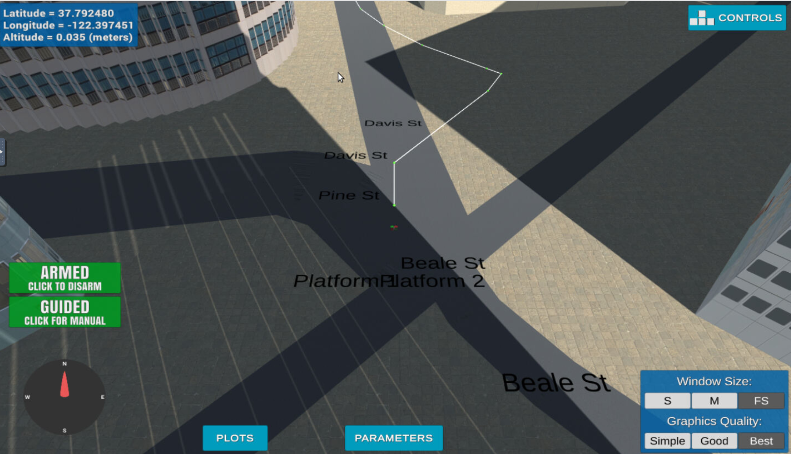

# 3D Motion Planning
FCND Project - 3D Motion Planning<br>

This project is a continuation of the Backyard Flyer project where a simple square shaped flight path was implemented. In this project plan algorithms have to be implemented to navigate from a to b in an urban environment avoiding fixed obstacles.<br>

The README at hand provides an overview about the solution of the second FCND project. I realized two solutions for the 3D Motion Planning Project: 
 - "Minimal Solution" with an augmented A*
 - Graph based planning.

A* solution is contained in `motion_planning.py` and `planning_utils.py`. <br>
Graph solution is available in `my_motion_planning_graph.py` and `my_planning_utils_graph.py`.<br>

The rest of this readme describes in which way the project objectives have been realized.

## Explain Motion Planning Code
While the code contains markups at all relevant steps (explaining imports, conversions, etc.) the main algorithm goes as follows:<br>
Switching State to planning
 ```
        self.flight_state = States.PLANNING
        print("Searching for a path ...")
        TARGET_ALTITUDE = 5
        SAFETY_DISTANCE = 5
 ```
Get home position from cvs file and set it as global home. Needed as reference for global_to_local for further local calculations.
  ```
        lat, lon =  open('colliders.csv').readline().split(",")
        lat0 = float(lat.strip("lat0 "))
        lon0 = float(lon.strip("lon0 "))
        self.set_home_position(lon0, lat0, 0)
 ```
Load colliders.cvs and build grid from it.
```
        data = np.loadtxt('colliders.csv', delimiter=',', dtype='Float64', skiprows=2)
        grid, north_offset, east_offset, edges = create_grid_and_edges(data, TARGET_ALTITUDE, SAFETY_DISTANCE)
```
For graph solution edges have to be calculated as well and put together to build a graph.
```
        G = nx.Graph()
        for e in edges:
            p1 = e[0]
            p2 = e[1]
            dist = LA.norm(np.array(p2) - np.array(p1))
            G.add_edge(p1, p2, weight=dist)NCE)
 ```
Ask for goal coordinates (For example: lon = -122.39725, lat = 37.79392).
 ```
        try:
            goal_lon = float(input("Please provide Lon value:"))
            goal_lat = float(input("Please provide Lat value:"))
        except ValueError:
            print("Please insert Lon/Lat as a float")
            sys.exit()
 ```
Derive local goal coordinates and calculate grid goal.
  ```
        global_goal = (goal_lon, goal_lat, 0)
        local_goal = global_to_local(global_goal, self.global_home)
        grid_goal = (-north_offset + int(local_goal[0]) , -east_offset + int(local_goal[1]))
 ```
Again, only for graph solution you have to match grid_start and grid_goal with corresponding graph edges using closest_point.
   ```
        start_ne_g = closest_point(G, grid_start)
        goal_ne_g = closest_point(G, grid_goal)
 ```
Now you have a start and goal coordinate on the grid/graph and can find a way between avoiding obstacles of course. I used A* in both cases. In the minimal solution with added diagonals. For the graph solution adaption have to be made to use voronoi points (networkx).

 ```
         path, cost = a_star(G, heuristic, start_ne_g, goal_ne_g)
 ```
 Check if path-knots can be reduced (using method prune_path with was added to the util files). Collinearty check.
 ```
         pruned_path = prune_path(path)
 
 ```
 At last path has to be converted to waypoints (cast to int) and sent to simulation to visualize flight.
  ```
        waypoints = [[int(p[0]) + north_offset, int(p[1]) + east_offset, TARGET_ALTITUDE, 0] for p in pruned_path]
 ```

## Implementing Your Path Planning Algorithm

Below the code for the more interesting graph solution is given. Markup is provided inline.
```
# from Voronoi Solution of class
def create_grid_and_edges(data, drone_altitude, safety_distance):
    """
    Returns a grid representation of a 2D configuration space
    along with Voronoi graph edges given obstacle data and the
    drone's altitude.
    """
    # minimum and maximum north coordinates
    north_min = np.floor(np.min(data[:, 0] - data[:, 3]))
    north_max = np.ceil(np.max(data[:, 0] + data[:, 3]))

    # minimum and maximum east coordinates
    east_min = np.floor(np.min(data[:, 1] - data[:, 4]))
    east_max = np.ceil(np.max(data[:, 1] + data[:, 4]))

    # given the minimum and maximum coordinates we can
    # calculate the size of the grid.
    north_size = int(np.ceil(north_max - north_min))
    east_size = int(np.ceil(east_max - east_min))

    # Initialize an empty grid
    grid = np.zeros((north_size, east_size))
    # Initialize an empty list for Voronoi points
    points = []
    # Populate the grid with obstacles
    for i in range(data.shape[0]):
        north, east, alt, d_north, d_east, d_alt = data[i, :]
        if alt + d_alt + safety_distance > drone_altitude:
            obstacle = [
                int(np.clip(north - d_north - safety_distance - north_min, 0, north_size-1)),
                int(np.clip(north + d_north + safety_distance - north_min, 0, north_size-1)),
                int(np.clip(east - d_east - safety_distance - east_min, 0, east_size-1)),
                int(np.clip(east + d_east + safety_distance - east_min, 0, east_size-1)),
            ]
            grid[obstacle[0]:obstacle[1]+1, obstacle[2]:obstacle[3]+1] = 1
            # add center of obstacles to points list
            points.append([north - north_min, east - east_min])

    # create a voronoi graph based on
    # location of obstacle centres
    graph = Voronoi(points)

    # check each edge from graph.ridge_vertices for collision
    edges = []
    for v in graph.ridge_vertices:
        p1 = graph.vertices[v[0]]
        p2 = graph.vertices[v[1]]
        cells = list(bresenham(int(p1[0]), int(p1[1]), int(p2[0]), int(p2[1])))
        hit = False

        for c in cells:
            # First check if we're off the map
            if np.amin(c) < 0 or c[0] >= grid.shape[0] or c[1] >= grid.shape[1]:
                hit = True
                break
            # Next check if we're in collision
            if grid[c[0], c[1]] == 1:
                hit = True
                break

        # If the edge does not hit on obstacle
        # add it to the list
        if not hit:
            # array to tuple for future graph creation step)
            p1 = (p1[0], p1[1])
            p2 = (p2[0], p2[1])
            edges.append((p1, p2))

    return grid, int(north_min), int(east_min), edges

def show_start_goal(grid, edges):
    plt.imshow(grid, origin='lower', cmap='Greys')

    for e in edges:
        p1 = e[0]
        p2 = e[1]
        plt.plot([p1[1], p2[1]], [p1[0], p2[0]], 'b-')


        plt.plot(start_ne[1], start_ne[0], 'rx')
        plt.plot(goal_ne[1], goal_ne[0], 'rx')

        plt.xlabel('EAST')
        plt.ylabel('NORTH')
        plt.show()


# From Graph solution of class
def a_star(graph, h, start, goal):
    """Modified A* to work with NetworkX graphs."""

    path = []
    path_cost = 0
    queue = PriorityQueue()
    queue.put((0, start))
    visited = set(start)

    branch = {}
    found = False

    while not queue.empty():
        item = queue.get()
        current_node = item[1]
        if current_node == start:
            current_cost = 0.0
        else:
            current_cost = branch[current_node][0]

        if current_node == goal:
            print('Found a path.')
            found = True
            break
        else:
            for next_node in graph[current_node]:
                cost = graph.edges[current_node, next_node]['weight']
                branch_cost = current_cost + cost
                queue_cost = branch_cost + h(next_node, goal)

                if next_node not in visited:
                    visited.add(next_node)
                    branch[next_node] = (branch_cost, current_node)
                    queue.put((queue_cost, next_node))

    if found:
        # retrace steps
        n = goal
        path_cost = branch[n][0]
        path.append(goal)
        while branch[n][1] != start:
            path.append(branch[n][1])
            n = branch[n][1]
        path.append(branch[n][1])
    else:
        print('**********************')
        print('Failed to find a path!')
        print('**********************')
    return path[::-1], path_cost


# Standard heuristic Norm. See class
def heuristic(n1, n2):
    return LA.norm(np.array(n2) - np.array(n1))


# From Graph solution of class
def closest_point(graph, current_point):
    """
    Compute the closest point in the `graph`
    to the `current_point`.
    """
    closest_point = None
    dist = 100000
    for p in graph.nodes:
        d = LA.norm(np.array(p) - np.array(current_point))
        if d < dist:
            closest_point = p
            dist = d
    return closest_point


#------------------------------------
#------------------------------------

# Method to reduce/prune path using collinearty function below.
def prune_path(path):
    # 3 points needed, otherwise path can not be reduced.
    if len(path) < 2:
        return path
    else:
        p = 2
        # since it can not be said how many reductions will be performed before hand, while is more convenient.
        while p < len(path) - 2:
            if collinearity(path[p], path[p+1], path[p+2]):
                path.remove(path[p+1])
            else:
                p += 1
        return path

# Implementation from course
# $ det according Sarrus rule$

def collinearity(p1, p2, p3):
    collinear = False
    # Calculate the determinant of the matrix using integer arithmetic
    det = p1[0]*(p2[1] - p3[1]) + p2[0]*(p3[1] - p1[1]) + p3[0]*(p1[1] - p2[1])
    # Set collinear to True if the determinant is equal to zero
    if det == 0:
        collinear = True
    return collinear
```

## Executing the flight

I tried a few spots. Here is picture of a calculated voronoi graph based path:


